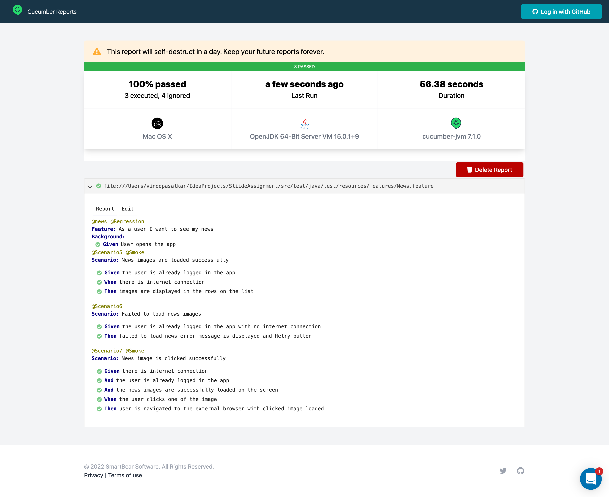

#### Sliide Assignment
Created using Java, Appium and Cucumber BDD framework for News mobile application.


#### Prerequisite for this project
Should have Java 11.X, gradle 6.X, appium 1.22.0, Android SDK, adb


#### Step-by-Step guide for test execution 📜 <br>

1.Take a clone of the repo from the github link
``git clone https://github.com/vinodpasalkar/SliideAssignment``

2.From terminal, Navigate to the project directory and  Run ```gradle build``` command 
to get all the dependency for the project and run the test from test runner

3.Start the appium server

4. Run the scenario
   Option 1 : straight from cucumber feature file via context click
   To run single scenario , right click on the specific scenario level and click on Run scenario
   To run the entire feature , right click on the feature level and click on Run feature

Option 2: Open terminal , Navigate to the project directory and execute below command
To run all the tests
- `gradle cucumber`
  Note: `cucumber` is a task name from the build.gradle
-
To run specific feature
- `gradle {taskname}`
- for e.g `gradle login` to run the login feature
- for e.g `gradle news` to run the new feature
  Note: `login` and `news` are task names from the build.gradle


#### Initial investigation 
1. To find the app package and the app activity to add to the appium capabilities 
Install  and launch the app on the emulator or real device , and execute below adb command
adb shell dumpsys window | grep -E 'mCurrentFocus' 

2. To simulate the internet connection on /off
adb shell svc wifi disable
adb shell svc data disable


#### Reporting ✅

News feature : https://reports.cucumber.io/reports/6c293506-3823-40c6-aa36-c47f40e36302 ( This link might expire as these reports self destruct in a day)


 
